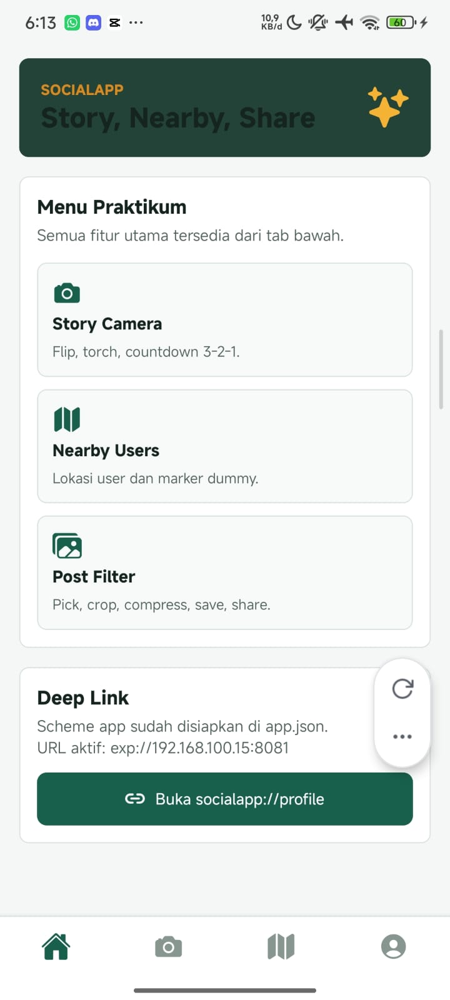
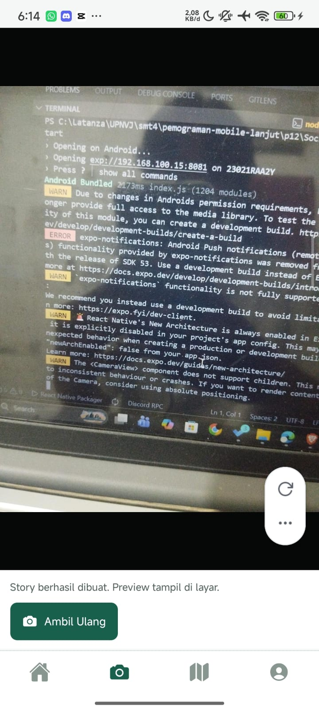
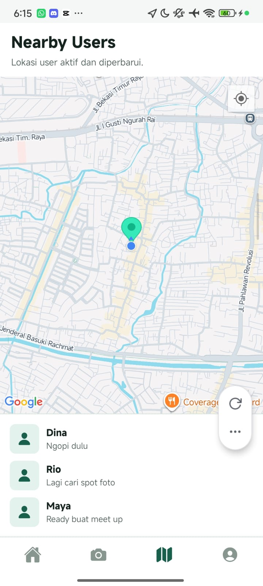
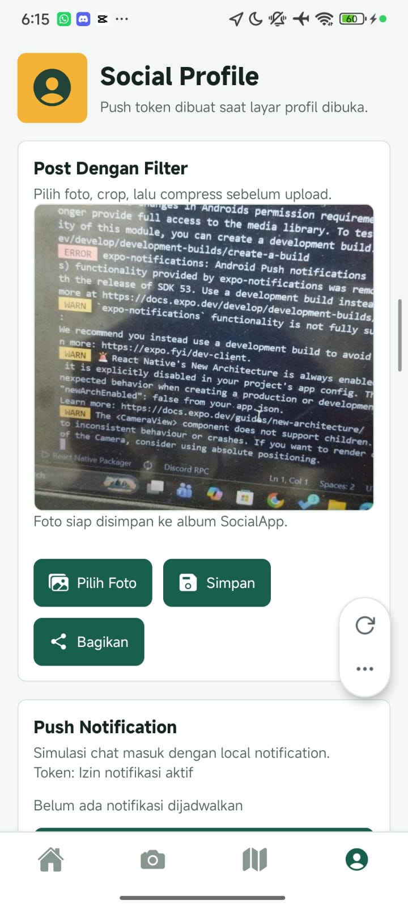
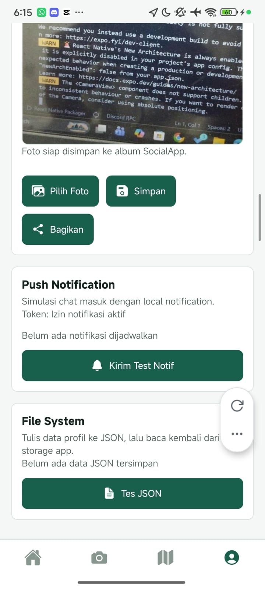
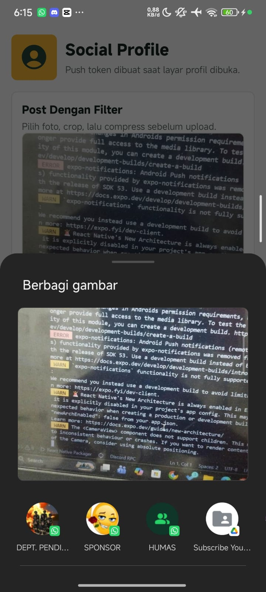

# SocialApp

SocialApp adalah aplikasi Expo SDK 54 untuk praktikum mobile lanjut. Aplikasi ini menguji permission flow, kamera, manipulasi gambar, lokasi, map, notifikasi lokal, file system, sharing, dan media library.

## Informasi Mahasiswa

Nama: Latanza Akbar Fadilah  
NIM: 2410501004  
Kelas: B

## Preview

| Home | Camera Preview | Nearby Users |
| --- | --- | --- |
|  |  |  |

| Profile | Post Filter | Sharing |
| --- | --- | --- |
|  |  |  |

## Fitur

- Permission flow dengan penjelasan sebelum memakai kamera, lokasi, galeri, media library, dan notifikasi.
- Story camera memakai `expo-camera` dan preview foto setelah shoot.
- Image resize/compress memakai `expo-image-manipulator` dengan sisi terpanjang maksimal 800px.
- GPS memakai `expo-location`, termasuk `watchPositionAsync` dan cleanup subscription.
- Map native memakai `react-native-maps`, dengan fallback aman jika API key Google Maps belum tersedia.
- Local notification memakai `expo-notifications`.
- File System memakai `expo-file-system` untuk menulis dan membaca JSON lokal.
- Sharing memakai `expo-sharing`.
- Media Library memakai `expo-media-library` untuk menyimpan foto ke galeri atau album app jika didukung.

## Dependensi Utama

| Dependensi | Fungsi |
| --- | --- |
| `expo` | Runtime dan tooling utama Expo SDK 54. |
| `react` | Library UI utama. |
| `react-native` | Framework aplikasi mobile native. |
| `@react-navigation/native` | Navigasi utama aplikasi. |
| `@react-navigation/bottom-tabs` | Navigasi tab bawah. |
| `@expo/vector-icons` | Icon UI berbasis Ionicons. |
| `expo-camera` | Kamera dan pengambilan foto. |
| `expo-image-picker` | Memilih foto dari galeri. |
| `expo-image-manipulator` | Resize dan compress gambar. |
| `expo-location` | Permission dan koordinat GPS. |
| `react-native-maps` | Tampilan MapView dan Marker. |
| `expo-notifications` | Local notification dan listener notifikasi. |
| `expo-file-system` | Tulis dan baca file JSON lokal. |
| `expo-sharing` | Membuka dialog share file. |
| `expo-media-library` | Menyimpan foto ke galeri atau album app. |
| `expo-status-bar` | Pengaturan status bar. |
| `react-native-safe-area-context` | Safe area untuk status bar dan area bawah device. |
| `react-native-screens` | Optimasi screen navigation native. |
| `expo-constants` | Membaca metadata runtime, termasuk deteksi Expo Go. |

## Dukungan Expo Go

| Checklist | Expo Go | Keterangan |
| --- | --- | --- |
| Permission flow | Bisa | Permission yang muncul adalah milik Expo Go, bukan package app final. |
| Camera `expo-camera` | Bisa | `CameraView`, ambil foto, dan preview bisa diuji. |
| Image Manipulator | Bisa | Resize/compress gambar bisa diuji. |
| Location GPS | Bisa | Koordinat device bisa diambil jika izin lokasi diberikan. |
| Maps `react-native-maps` | Terbatas | Bisa berbeda antar device. Bukan bukti final untuk APK sendiri. |
| Local Notification | Bisa sebagian | Local notification bisa diuji, tetapi Expo Go Android SDK 53+ punya limitasi untuk remote/push notifications. |
| File System JSON | Bisa | Tulis dan baca JSON internal app bisa diuji. |
| Sharing | Bisa | Dialog share bisa dibuka. |
| Media Library save | Terbatas | Android Expo Go tidak memberi full media library access untuk semua skenario permission baru. |
| Cleanup listener/watch | Bisa dicek | Cleanup ada di kode untuk notification listener dan location watcher. |

## Dukungan Prebuild / Development Build / APK

| Checklist | Prebuild / APK | Keterangan |
| --- | --- | --- |
| Permission flow | Bisa | Lebih valid karena permission milik app `com.latanza.socialapp`. |
| Camera `expo-camera` | Bisa | Valid untuk checklist. |
| Image Manipulator | Bisa | Valid untuk checklist. |
| Location GPS | Bisa | Valid jika izin lokasi diberikan. |
| Maps `react-native-maps` | Bisa dengan API key | Android APK sendiri membutuhkan Google Maps API key. Tanpa API key, app menampilkan fallback koordinat agar tidak crash. |
| Local Notification | Bisa | Lebih valid daripada Expo Go. |
| File System JSON | Bisa | Valid untuk checklist. |
| Sharing | Bisa | Valid untuk checklist. |
| Media Library save | Bisa | Lebih valid daripada Expo Go jika permission native sudah terpasang. |
| Cleanup listener/watch | Bisa | Valid lewat kode dan runtime. |

## Google Maps API Key

Untuk menampilkan `MapView` asli di Android development build atau APK, isi API key di `app.json`.

```json
{
  "expo": {
    "android": {
      "config": {
        "googleMaps": {
          "apiKey": "GOOGLE_MAPS_API_KEY_KAMU"
        }
      }
    }
  }
}
```

Setelah mengubah konfigurasi native, rebuild aplikasi:

```bash
npx expo run:android
```

## Menjalankan Aplikasi

```bash
npm install
npx expo start -c
```

Untuk development build Android:

```bash
npx expo run:android
npx expo start --dev-client -c
```

## Catatan Testing

- Tes Media Library dan Maps paling valid dilakukan di development build atau APK.
- Jika build Android di Windows terkena batas path CMake/Ninja, project ini memakai `newArchEnabled: false` untuk menghindari path codegen yang terlalu panjang.
- Jika memakai Expo Go, buka permission dari Settings aplikasi Expo Go saat permission pernah ditolak.
